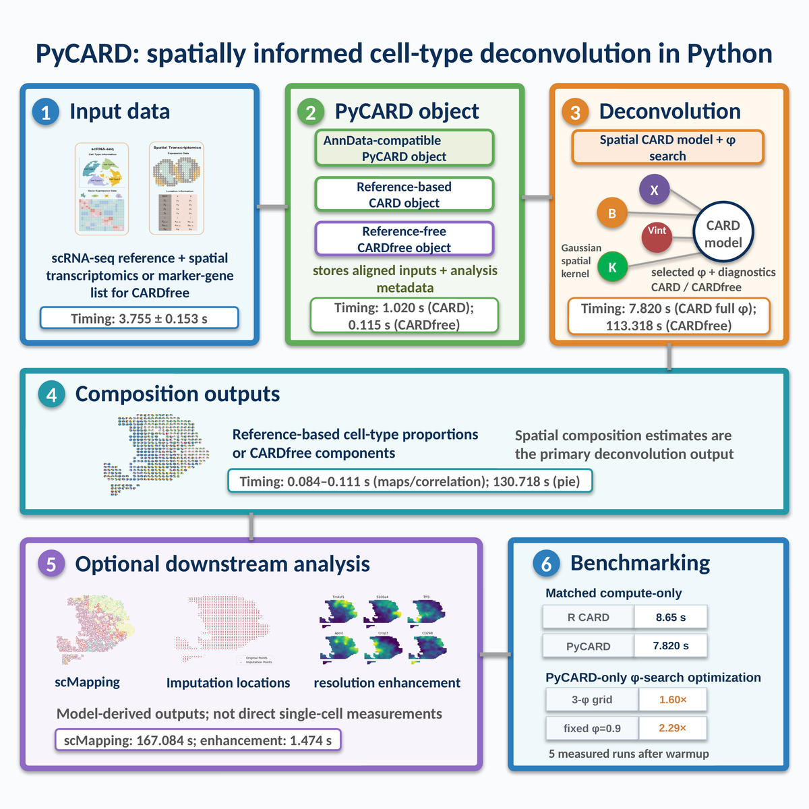
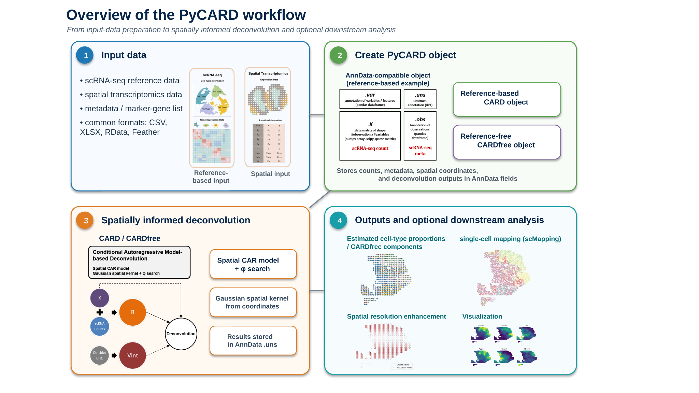
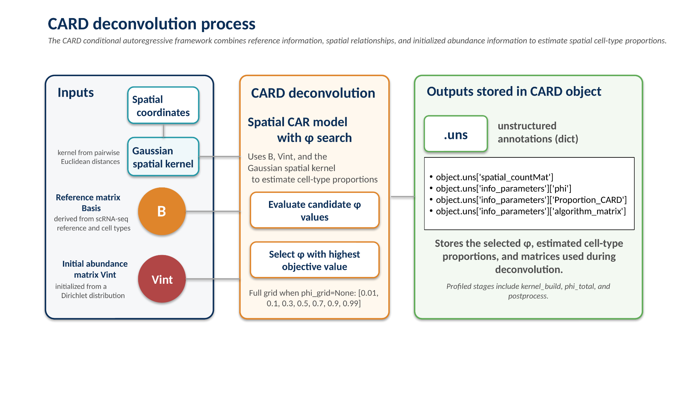
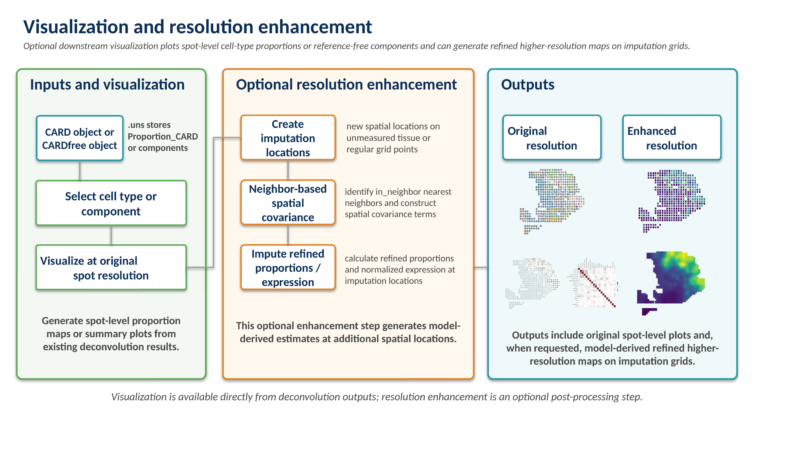

# PyCARD

**Version 1.0.1**

PyCARD is a Python implementation of CARD for spatially informed cell-type deconvolution of spatial transcriptomics data.

PyCARD provides Python-based workflows for:

- Reference-based CARD deconvolution
- Reference-free CARDfree deconvolution
- Single-cell resolution mapping (`scMapping`)
- Spatial resolution enhancement / imputation
- Visualization of CARD outputs
- C++-accelerated computation through `pybind11`
- Configurable CARD optimization parameters, including user-defined `phi` settings

PyCARD Version 1.0.1 is the software version used for the accompanying STAR Protocols protocol. The repository includes the Python and C++/`pybind11` source code, example and benchmark data, and benchmark-reproduction materials used to document the reported runtime measurements.

The current release has been independently validated in a clean Conda environment on Ubuntu / WSL Ubuntu using Python 3.10.19.

<p align="center">
  
</p>

## Overview

PyCARD organizes spatial transcriptomics inputs, optional scRNA-seq reference data or marker-gene information, deconvolution outputs, and downstream analyses in a Python-centered workflow. Reference-based CARD and reference-free CARDfree are supported, together with optional single-cell mapping, spatial resolution enhancement, visualization, and reproducible performance benchmarking.

<p align="center">
  
</p>

*Figure 1. Overview of the PyCARD workflow. Input preparation is followed by construction of reference-based CARD or reference-free CARDfree objects, spatially informed deconvolution, and optional downstream analysis.*

## Background: CARD

CARD (Conditional AutoRegressive-based Deconvolution) is a spatially informed cell-type deconvolution method developed for spatial transcriptomics data.

Spatial transcriptomics measurements typically capture gene expression from spatial locations that may contain mixtures of multiple cell types. CARD estimates cell-type composition by jointly using gene-expression information and the spatial relationships among measurement locations.

In the reference-based workflow, CARD integrates:

- spatial transcriptomics gene-expression data;
- spatial coordinates;
- single-cell RNA-sequencing reference expression; and
- cell-type annotations.

The spatial structure of neighboring locations is incorporated into the deconvolution framework so that estimation uses both molecular information and spatial context.

PyCARD implements the CARD workflow in Python while preserving the core spatially informed deconvolution concept of the original method. It additionally provides a Python-centered workflow for configurable optimization, reference-free CARDfree analysis, downstream single-cell mapping, spatial resolution enhancement, visualization, and reproducible benchmarking.

This repository is an implementation and workflow resource rather than a replacement for the original CARD methodological description. For the full statistical formulation, biological motivation, and original validation of CARD, see the original publication and project documentation listed below.

<p align="center">
  
</p>

*Figure 4. CARD deconvolution process. The CARD framework combines cell-type-specific basis information, initialized abundance estimates, and a spatial kernel derived from spatial coordinates; candidate `phi` values are evaluated and the estimated spatial proportions and diagnostics are stored in the CARD object.*

## Version and STAR Protocols release

This repository corresponds to:

```text
PyCARD Version 1.0.1
```

The package version is defined in `CARD/__init__.py` as:

```python
__version__ = "1.0.1"
```

The STAR Protocols manuscript reports results generated with PyCARD Version 1.0.1.

For archival releases, use:

```text
Git tag: v1.0.1
GitHub release: PyCARD v1.0.1
```

## Repository structure

```text
PyCARD/
├── CARD/
│   ├── __init__.py
│   ├── CARDSCMapping.py
│   ├── CARDimputation.py
│   ├── CARDprop.py
│   ├── CARDrefFree.py
│   ├── CARDrun.py
│   ├── dataload.py
│   ├── pyNMFpackage.py
│   ├── utilities.py
│   └── visualization.py
│
├── src/
│   ├── CARDref.cpp
│   ├── CARDref.hpp
│   ├── CARDref_wrapper.cpp
│   ├── CARDfree.cpp
│   ├── CARDfree.hpp
│   └── CARDfree_wrapper.cpp
│
├── benchmark/
│   ├── README.md
│   ├── timing_protocol.py
│   └── timing_protocol_results.csv
│
├── data/
│   ├── markerList.csv
│   ├── sc_count.csv
│   ├── sc_meta.csv
│   ├── spatial_count.csv
│   └── spatial_location.csv
│
├── docs/
│   └── figures/
│       ├── graphical_abstract.png
│       ├── figure1_pycard_workflow.png
│       ├── figure4_card_deconvolution.png
│       └── figure8_visualization_enhancement.png
│
├── CMakeLists.txt
├── main.py
├── requirements.txt
├── .gitattributes
├── .gitignore
├── README.md
└── LICENSE
```

The repository contains the example and benchmark dataset used by the documented workflows. Because `data/sc_count.csv` exceeds GitHub's normal per-file size limit, that file is managed using Git LFS. The remaining data files are stored as standard Git objects.

Compiled extension modules, local build outputs, cache files, editor metadata, temporary files, and other generated artifacts are excluded from version control.

## Requirements

PyCARD Version 1.0.1 has been exercised in two related but distinct software environments:

1. the **clean release-validation environment**, used to verify that the released source can be installed, built, and executed independently; and
2. the **STAR Protocols benchmark environment**, used for the runtime measurements reported in the manuscript.

The current release has been independently validated on **Ubuntu / WSL Ubuntu**.

PyCARD is also expected to run on **macOS**, including MacBook systems, when equivalent Python, C/C++, CMake, Eigen, Armadillo, R, and Python-package dependencies are available. However, macOS has not yet been included in the formal clean release-validation procedure for Version 1.0.1. Platform-specific configuration may therefore be required, particularly for compiled dependencies and R-based CARDfree functionality.

These environments and platforms should not be interpreted as identical benchmark configurations.

### Release-validation environment

The current source release was validated using:

- Linux / WSL Ubuntu
- Python 3.10.19
- GNU C/C++ compiler
- CMake
- Eigen3
- Armadillo
- R 4.1.2
- `pybind11` 2.11.1

The validated direct Python dependencies include:

```text
numpy==1.26.4
pandas==2.2.3
scipy==1.11.4
scikit-learn==1.3.2
anndata==0.10.9
matplotlib==3.8.4
seaborn==0.13.1
nimfa==1.4.0
mlpack==4.3.0.post2
geopandas==0.14.2
alphashape==1.3.1
shapely==2.0.2
pyreadr==0.5.0
rpy2==3.5.16
pybind11==2.11.1
```

R support is used by the current CARDfree implementation through `rpy2`, including the R-based NMF backend options.

### STAR Protocols benchmark environment

The runtime measurements reported in the STAR Protocols manuscript were generated using the benchmark environment described in the protocol, including:

```text
Python 3.10.19
NumPy 1.26.4
pandas 2.2.3
SciPy 1.11.4
scikit-learn 1.3.2
AnnData 0.10.9
Matplotlib 3.8.4
Seaborn 0.13.1
Nimfa 1.4.0
mlpack 4.3.0.post1
GeoPandas 0.14.2
alphashape 1.3.1
Shapely 2.0.2
pyreadr 0.5.0
rpy2 3.5.16
pybind11 2.11.1
CMake 3.30.3
Eigen3 3.4.0
Armadillo 10.8.2
R 4.2.2
Ubuntu 22.04.4 LTS
```

The benchmark manuscript environment used `mlpack 4.3.0.post1`, whereas the clean release-validation environment uses `mlpack 4.3.0.post2`. The latter is retained in the current release requirements because it was the installable version used during clean-environment release validation. This version difference does not change the benchmark values already reported in the manuscript.

Similarly, the manuscript benchmark comparison used R 4.2.2, while the independent clean release-validation environment used R 4.1.2. The reported benchmark results should therefore be interpreted using the benchmark environment documented in the manuscript rather than the later clean-validation environment.

## Installation

### 1. Create a Conda environment

```bash
conda create -n pycard python=3.10.19 pip -y
conda activate pycard
```

For a clean installation, prevent packages from a user-level Python installation from being injected into the environment:

```bash
unset PYTHONPATH
export PYTHONNOUSERSITE=1
```

Verify the active Python installation:

```bash
python --version
which python
```

### 2. Install system dependencies

#### Ubuntu / WSL Ubuntu — validated platform

```bash
sudo apt update
sudo apt install -y build-essential cmake libeigen3-dev libarmadillo-dev
```

Check that R is available:

```bash
R --version
```

The independent release-validation environment used R 4.1.2. The STAR Protocols benchmark environment used R 4.2.2 for the reported R benchmark measurements.

#### macOS — expected supported platform

On macOS, equivalent system dependencies can be installed using Homebrew or another suitable package manager. For example:

```bash
brew install cmake eigen armadillo r
```

Then create the same Python environment and install the Python dependencies. macOS users should note that compiled dependencies, R configuration, and `rpy2`/R-based CARDfree backends may require platform-specific setup. Version 1.0.1 has not yet undergone the same formal clean-environment validation procedure on macOS that was performed on Ubuntu / WSL Ubuntu.

The STAR Protocols benchmark results were generated in the Linux/Ubuntu benchmark environment documented in the manuscript and should not be interpreted as macOS performance measurements.

### 3. Install Python dependencies

From the PyCARD project root:

```bash
python -m pip install -r requirements.txt
```

The current release requirements correspond to the clean release-validation environment. In particular, the release uses `mlpack==4.3.0.post2`, whereas the STAR Protocols benchmark environment used `mlpack==4.3.0.post1`.

### 4. Build the C++ modules

PyCARD uses two C++ extension modules:

- `CARDref_module`
- `CARDfree_module`

Both modules are built using the top-level `CMakeLists.txt`.

```bash
cmake -S . -B build \
  -Dpybind11_DIR="$(python -m pybind11 --cmakedir)"
cmake --build build -j
```

A successful build should generate files similar to:

```text
build/CARDref_module.cpython-310-x86_64-linux-gnu.so
build/CARDfree_module.cpython-310-x86_64-linux-gnu.so
```

Verify the modules:

```bash
PYTHONPATH=./build python -c \
"import CARDref_module; print('CARDref OK:', CARDref_module.__file__)"

PYTHONPATH=./build python -c \
"import CARDfree_module; print('CARDfree OK:', CARDfree_module.__file__)"
```

The `build/` directory and compiled `*.so` modules are local build artifacts and are not stored as normal source files in the Git repository.

## Benchmark and example data

The repository includes the example and benchmark data used by the documented PyCARD workflows:

```text
data/
├── markerList.csv
├── sc_count.csv
├── sc_meta.csv
├── spatial_count.csv
└── spatial_location.csv
```

The benchmark dataset included under `data/` is the same dataset used for comparison with the original CARD implementation. The same source dataset is also available from the original CARD repository:

https://github.com/YMa-lab/CARD/tree/master/data

Because `data/sc_count.csv` exceeds GitHub's regular per-file size limit, it is managed using Git LFS. After cloning the repository:

```bash
git lfs install
git lfs pull
```

By default, PyCARD reads input data from `./data`. A different input directory can be selected with:

```bash
PYTHONPATH=./build python main.py --data-dir /path/to/data
```

For standard reference-based CARD deconvolution, the expected inputs are:

```text
spatial_count.csv
spatial_location.csv
sc_count.csv
sc_meta.csv
```

For CARDfree deconvolution, the expected inputs are:

```text
spatial_count.csv
spatial_location.csv
markerList.csv
```

CARDfree does not require `sc_count.csv` or `sc_meta.csv`.

## Benchmark reproduction materials

The repository contains:

```text
benchmark/
├── README.md
├── timing_protocol.py
└── timing_protocol_results.csv
```

The timing protocol uses **1 warm-up run and 5 measured runs** by default. The standard benchmark is launched from the project root with:

```bash
python benchmark/timing_protocol.py --data-dir ./data
```

CARDfree is a separate, longer-running workflow and can be included with:

```bash
python benchmark/timing_protocol.py --data-dir ./data --include-cardfree
```

or run by itself with:

```bash
python benchmark/timing_protocol.py --data-dir ./data --only cardfree
```

See `benchmark/README.md` for individual benchmark groups, parameter settings, and output behavior.

# Quick Start

All commands below assume that the C++ extension modules have already been built in `build/`.

## Reference-based CARD deconvolution

Standard reference-based CARD deconvolution runs by default when no explicit workflow flag is provided:

```bash
PYTHONPATH=./build python main.py
```

The default command-line settings include:

```text
phi-grid = 0.9
max-iter = 200
epsilon = 1e-4
```

For additional runtime information:

```bash
PYTHONPATH=./build python main.py --verbose
```

Standard CARD can also be selected explicitly:

```bash
PYTHONPATH=./build python main.py --run-deconvolution
```

## Configuring `phi`

The command-line workflow uses a fixed default `--phi-grid 0.9`.

A different grid can be specified as a comma-separated list:

```bash
PYTHONPATH=./build python main.py \
  --phi-grid 0.1,0.5,0.9 \
  --verbose
```

The full `phi` grid used by the full-search implementation is:

```text
0.01,0.1,0.3,0.5,0.7,0.9,0.99
```

Warm-start behavior across `phi` values can optionally be enabled with `--warm-start-phi`.

The command-line fixed default should be distinguished from a direct Python API call to CARD deconvolution with `phi_grid=None`, which performs the full `phi` search.

## Reference-free CARDfree deconvolution

CARDfree can be run independently with:

```bash
PYTHONPATH=./build python main.py --run-cardfree
```

When `--run-cardfree` is specified by itself, PyCARD runs the CARDfree workflow only. It does **not** first run standard reference-based CARD deconvolution.

CARDfree requires `spatial_count.csv`, `spatial_location.csv`, and `markerList.csv` from the selected `--data-dir`, and does not require `sc_count.csv` or `sc_meta.csv`.

The NMF backend is selected with `--cardfree-nmf-select`:

```text
1  scikit-learn NMF
2  nimfa NMF
3  mlpack NMF
4  R NMF package
5  RcppML-based R NMF
```

The current default is `--cardfree-nmf-select 4`.

When an explicit R library path is required:

```bash
PYTHONPATH=./build python main.py \
  --run-cardfree \
  --set-r-libs-user ~/R/library
```

## Running reference-based CARD and CARDfree together

```bash
PYTHONPATH=./build python main.py \
  --run-deconvolution \
  --run-cardfree
```

## Single-cell resolution mapping

Requesting `scMapping` automatically runs standard CARD deconvolution first:

```bash
PYTHONPATH=./build python main.py --run-scmapping
```

Example benchmark configuration:

```bash
PYTHONPATH=./build python main.py \
  --run-scmapping \
  --scmapping-num-cell 20 \
  --scmapping-ncore 10
```

## Spatial resolution enhancement / imputation

Requesting imputation also automatically runs standard CARD deconvolution first:

```bash
PYTHONPATH=./build python main.py --run-imputation
```

Example benchmark configuration:

```bash
PYTHONPATH=./build python main.py \
  --run-imputation \
  --imputation-num-grids 2000 \
  --imputation-in-neighbor 10
```

## Workflow-selection behavior

| Command | Workflow |
|---|---|
| `python main.py` | Standard CARD |
| `python main.py --run-deconvolution` | Standard CARD |
| `python main.py --run-cardfree` | CARDfree only |
| `python main.py --run-deconvolution --run-cardfree` | Standard CARD + CARDfree |
| `python main.py --run-scmapping` | Standard CARD + scMapping |
| `python main.py --run-imputation` | Standard CARD + imputation |

# Python API

The command-line workflow in `main.py` is built on the same PyCARD functions that can be called directly from Python.

## Load data

```python
from CARD.dataload import _load_data

spatial_count = _load_data("./data/spatial_count.csv", "csv")
spatial_location = _load_data("./data/spatial_location.csv", "csv")
sc_count = _load_data("./data/sc_count.csv", "csv")
sc_meta = _load_data("./data/sc_meta.csv", "csv")
```

## Reference-based CARD deconvolution

```python
from CARD.CARDrun import _run_CARD_deconvolution

CARD_obj = _run_CARD_deconvolution(
    sc_count=sc_count,
    sc_meta=sc_meta,
    spatial_count=spatial_count,
    spatial_location=spatial_location,
)
```

## Reference-free CARDfree deconvolution

CARDfree uses spatial counts, spatial locations, and marker genes rather than a single-cell reference dataset:

```python
from CARD.CARDrun import _run_CARDfree_deconvolution

CARDfree_obj = _run_CARDfree_deconvolution(
    spatial_count=spatial_count,
    spatial_location=spatial_location,
    nmfSelect=4,
    marker_list_path="./data/markerList.csv",
)
```

## Single-cell mapping

```python
from CARD.CARDrun import _run_CARD_scMapping

scMapping = _run_CARD_scMapping(
    CARD_obj,
    shapeSpot="Square",
    numCell=20,
    ncore=10,
)
```

## Spatial resolution enhancement / imputation

```python
from CARD.CARDrun import _run_CARD_imputation

CARDimput_obj = _run_CARD_imputation(
    CARD_obj,
    num_grids=2000,
    in_neighbor=10,
    exclude=None,
    showGrid=True,
)
```

Functions in `CARD.CARDrun` provide convenience wrappers around the underlying PyCARD implementation. Advanced users may call lower-level classes and functions directly when they require more explicit control over optimization parameters, intermediate objects, NMF configuration, downstream mapping, imputation, or visualization.

# Visualization

PyCARD provides visualization functionality through `_run_CARD_visualization`.

Available visualization modes include:

```text
visual_pie
visual_prop
visual_prop_2CT
visual_cor
visual_imput_loc
visual_gene
visual_scmapping
```

<p align="center">
  
</p>

*Figure 8. Visualization and spatial resolution enhancement. PyCARD visualizes deconvolution results at the original spot resolution and can optionally generate model-derived higher-resolution representations.*

A basic example is:

```python
from CARD.CARDrun import _run_CARD_visualization

visual_functions = [
    (
        "visual_pie",
        {
            "proportion": prop_data,
            "spatial_location": spatial_data,
        },
    ),
    (
        "visual_prop",
        {
            "proportion": prop_data,
            "spatial_location": spatial_data,
            "ct_visualize": ct_data,
        },
    ),
]

_run_CARD_visualization(visual_functions)
```

# Reproducing STAR Protocols Benchmarks

The benchmark procedure uses 1 warm-up run followed by 5 measured runs. Mean and standard deviation values are calculated from the five measured runs.

## Reference-based CARD: Python versus R

For the matched reference-based CARD compute comparison, PyCARD was evaluated using the full `phi` search.

| Implementation | Mean runtime (s) | SD (s) |
|---|---:|---:|
| Original CARD R implementation | 8.65 | 0.18 |
| PyCARD full `phi` search | 7.820 | 0.164 |

Under this matched compute comparison, PyCARD shows approximately a 9% reduction in mean runtime relative to the original R implementation on the benchmark system.

## End-to-end timing

| Workflow | Input loading (s) | Compute (s) | Total (s) |
|---|---:|---:|---:|
| Original CARD R implementation | 0.19 | 8.68 | 8.87 |
| PyCARD fixed `phi=0.9` workflow | 3.67 | 3.38 | 7.14 |

These values are not a matched default-to-default comparison because the PyCARD measurement uses a fixed `phi=0.9`, whereas the reported R workflow uses its default search behavior. They characterize representative end-to-end execution rather than the primary matched R-versus-Python performance comparison.

## Configurable `phi` search

| PyCARD configuration | Mean runtime (s) | SD (s) | Relative speed |
|---|---:|---:|---:|
| Full 7-value `phi` grid | 7.820 | 0.164 | 1.00x |
| Reduced 3-value `phi` grid `[0.1, 0.5, 0.9]` | 4.890 | 0.086 | 1.60x |
| Fixed `phi=0.9` | 3.412 | 0.237 | 2.29x |

The full grid is `[0.01, 0.1, 0.3, 0.5, 0.7, 0.9, 0.99]`.

## Standard quick-start timing

The standard fixed-`phi=0.9` quick-start workflow was measured at:

```text
7.142 ± 0.204 s
```

This is the complete quick-start workflow and should not be confused with the `3.412 ± 0.237 s` fixed-`phi` deconvolution compute measurement.

## CARDfree timing

```text
CARDfree object creation: 0.115 ± 0.003 s
CARDfree deconvolution:    113.318 ± 2.478 s
```

## Single-cell mapping

```text
scMapping (numCell=20, ncore=10): 167.084 ± 0.900 s
```

## Spatial resolution enhancement

```text
Spatial resolution enhancement (num_grids=2000, in_neighbor=10):
1.474 ± 0.668 s
```

## Visualization timing

| Visualization | Mean runtime (s) | SD (s) |
|---|---:|---:|
| `CARD_visualize_pie` | 130.718 | 0.709 |
| `CARD_visualize_prop` | 0.088 | 0.006 |
| `CARD_visualize_prop_2CT` | 0.111 | 0.073 |
| `CARD_visualize_Cor` | 0.084 | 0.002 |

Additional measured components include:

```text
Input data loading (4 CSV files):      3.755 ± 0.153 s
Reference-based CARD object creation:  1.020 ± 0.059 s
```

Benchmark timings are hardware- and software-environment dependent. Preserve the same dataset, parameter settings, workflow boundaries, and benchmark protocol when making comparisons.

# Command-Line Options

Display the available options with:

```bash
PYTHONPATH=./build python main.py --help
```

Principal options include:

```text
--data-dir
--set-r-libs-user
--run-deconvolution
--run-scmapping
--run-imputation
--run-cardfree
--phi-grid
--warm-start-phi
--max-iter
--epsilon
--scmapping-num-cell
--scmapping-ncore
--imputation-num-grids
--imputation-in-neighbor
--imputation-show-grid
--cardfree-nmf-select
--verbose
```

# Release Validation

PyCARD Version 1.0.1 was validated using a newly created Conda environment rather than relying on the original development environment.

The clean release-validation platform was:

```text
Ubuntu / WSL Ubuntu
Python 3.10.19
```

The validation procedure included:

1. Creating a clean Conda environment using Python 3.10.19.
2. Preventing user-level Python packages from being injected into the clean environment.
3. Installing Python dependencies from `requirements.txt`.
4. Installing the required system-level C/C++ dependencies.
5. Configuring the project using the top-level `CMakeLists.txt`.
6. Building both `CARDref_module` and `CARDfree_module`.
7. Importing both compiled C++ extension modules successfully.
8. Running standard reference-based CARD deconvolution.
9. Running CARDfree independently using `--run-cardfree`.
10. Confirming that CARDfree runs without `sc_count.csv` or `sc_meta.csv` when supplied with `spatial_count.csv`, `spatial_location.csv`, and `markerList.csv`.
11. Running standard CARD and CARDfree together.
12. Running `scMapping`.
13. Running spatial resolution enhancement / imputation.
14. Confirming successful completion of the tested workflows.

The formal clean-environment validation for Version 1.0.1 was performed on Ubuntu / WSL Ubuntu. PyCARD is expected to run on macOS when equivalent dependencies are available, but macOS has not yet undergone the same formal clean-validation procedure for this release.

# Reproducibility Notes

Users reproducing STAR Protocols results should distinguish between the software environment used for the reported benchmark measurements, the later clean environment used to validate Version 1.0.1, and local environments used for independent reproduction.

The manuscript benchmark values correspond to the benchmark environment and should not be treated as timing measurements from the later release-validation environment.

Runtime comparisons should preserve the same workflow boundaries and parameter settings. In particular:

- full-`phi` CARD timing should be compared with another full-`phi` CARD workflow;
- fixed-`phi` timing should not be presented as a matched default-to-default comparison with the original R workflow;
- quick-start total runtime should not be confused with deconvolution compute-only runtime;
- CARDfree timing should not be directly compared with reference-based CARD timing because the computational workflows differ;
- `scMapping` timing depends on settings such as `numCell` and `ncore`; and
- visualization timing depends on the selected rendering function and graphics environment.

Benchmark timings can vary with CPU architecture, core count, BLAS implementation, compiler settings, R configuration, NMF backend, Python package builds, operating system, graphics backend, memory, and storage performance.

The Git repository contains source code and reproducibility materials. Generated artifacts such as `build/`, `*.so`, Python caches, CMake build files, editor metadata, and temporary files are excluded from normal version control and should be rebuilt locally.

For results intended to reproduce the STAR Protocols submission, record:

```text
PyCARD Version 1.0.1
Git tag: v1.0.1
```

# Original CARD

PyCARD is based on the CARD methodology originally developed by Ying Ma and Xiang Zhou.

Original publication:

Ying Ma and Xiang Zhou. **Spatially informed cell-type deconvolution for spatial transcriptomics.** *Nature Biotechnology* 40, 1349–1359 (2022).

Original CARD documentation:

https://yma-lab.github.io/CARD/

Original CARD repository:

https://github.com/YMa-lab/CARD

Original CARD benchmark data:

https://github.com/YMa-lab/CARD/tree/master/data

Users interested in the statistical formulation, original R implementation, or original CARD validation should refer to these resources.

# PyCARD Repository

https://github.com/faishim/PyCARD

The STAR Protocols release corresponds to:

```text
PyCARD Version 1.0.1
Git tag: v1.0.1
```

# Citation

If you use PyCARD, please cite the original CARD publication:

Ying Ma and Xiang Zhou. **Spatially informed cell-type deconvolution for spatial transcriptomics.** *Nature Biotechnology* 40, 1349–1359 (2022).

Please also cite the PyCARD STAR Protocols article once its final bibliographic information is available.

# Data and Code Availability

The PyCARD source code is available from:

https://github.com/faishim/PyCARD

The Version 1.0.1 repository contains the Python implementation and the C++ / `pybind11` source code required to build the accelerated CARD modules.

The repository also contains the benchmark-reproduction materials under `benchmark/` and the benchmark dataset under `data/`.

The same benchmark dataset used for comparison of the Python and R implementations is also available from the original CARD repository:

https://github.com/YMa-lab/CARD/tree/master/data

Because `data/sc_count.csv` exceeds GitHub's normal per-file size limit, it is distributed through Git LFS.

A permanent archival release of PyCARD Version 1.0.1 is intended to be deposited in Zenodo. The DOI should be added here and to the STAR Protocols manuscript after the archive has been created.

# License

PyCARD is released under the MIT License. See `LICENSE` for the complete license terms.

The original CARD software and associated resources remain subject to the terms and attribution requirements of their respective distribution.
